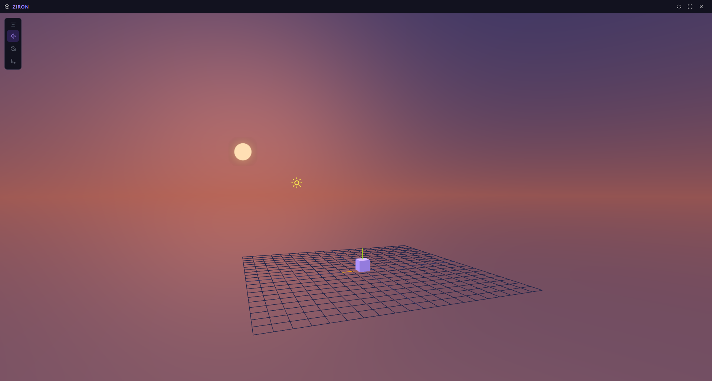
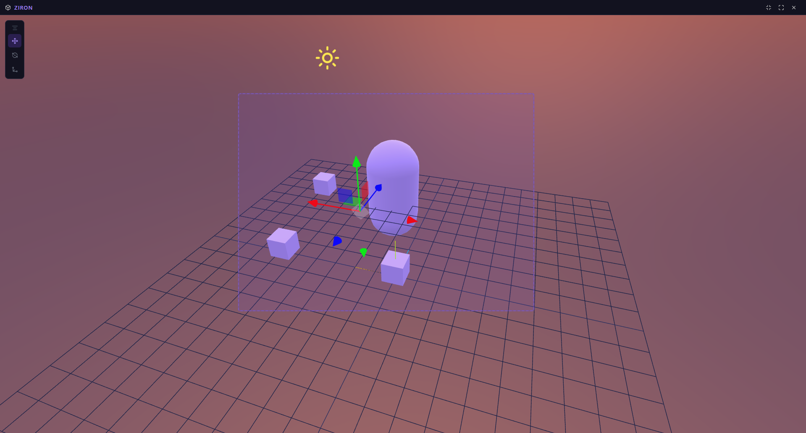

# ZIRON Engine

> A lightweight 3D scene editor built with Tauri, Three.js and Vite.



---

## What is ZIRON?

ZIRON Engine is a desktop 3D editor aimed at eventually becoming a full game engine. Right now it sits at the foundation layer — a native desktop window running a real-time Three.js viewport, with editor-grade controls and tools, packaged as a native app via Tauri.

No Electron. No browser tab. Just a lean, native binary with a WebGL renderer inside.

---

## Stack

| Layer            | Technology                           |
| ---------------- | ------------------------------------ |
| Desktop shell    | [Tauri v2](https://tauri.app) (Rust) |
| 3D renderer      | [Three.js](https://threejs.org)      |
| Frontend tooling | [Vite](https://vitejs.dev)           |
| UI icons         | [Lucide](https://lucide.dev)         |

---

## Current features

ZIRON is in very early development. What's working today:

- **3D viewport** — real-time WebGL scene with a skybox and directional sun light
- **Fly camera** — navigate the scene with `W A S D` + right-click drag
- **Transform gizmo** — translate, rotate and scale selected objects
- **Single selection** — click any mesh to select it and attach the gizmo
- **Multi-selection** — drag a marquee box to select multiple entities at once
- **Context menu** — right-click the viewport to add or remove objects from the scene
- **History** — undo/redo for transform operations
- **Logging system** — internal structured logger for debugging



---

## What it is NOT (yet)

ZIRON currently has no runtime or game logic layer. There is no scripting, no physics, no asset pipeline and no play mode. The goal is to build those systems on top of the editor foundation that exists today.

---

## Getting started

### Prerequisites

- [Node.js](https://nodejs.org) 18+
- [Rust](https://rustup.rs) (for Tauri)
- Tauri CLI — `cargo install tauri-cli`

### Install

```bash
git clone https://github.com/superstrellaa/ziron
cd ziron
npm install
```

### Run in development

```bash
npm run tauri dev
```

### Build

```bash
npm run tauri build
```

---

## Controls

| Input                  | Action               |
| ---------------------- | -------------------- |
| `W A S D`              | Move camera          |
| Right-click drag       | Look around          |
| Left-click             | Select object        |
| Left-click drag        | Marquee multi-select |
| Right-click (viewport) | Open context menu    |
| `Ctrl + Z`             | Undo                 |
| `Ctrl + Y`             | Redo                 |
| `T`                    | Translate mode       |
| `R`                    | Rotate mode          |
| `S`                    | Scale mode           |

---

## Roadmap (This can be outdated)

- [ ] Entity inspector panel (position, rotation, scale inputs)
- [ ] Asset drag-and-drop (glTF / OBJ)
- [ ] Scene save / load (JSON)
- [ ] Scripting layer (runtime)
- [ ] Physics integration

---

## License

MIT
