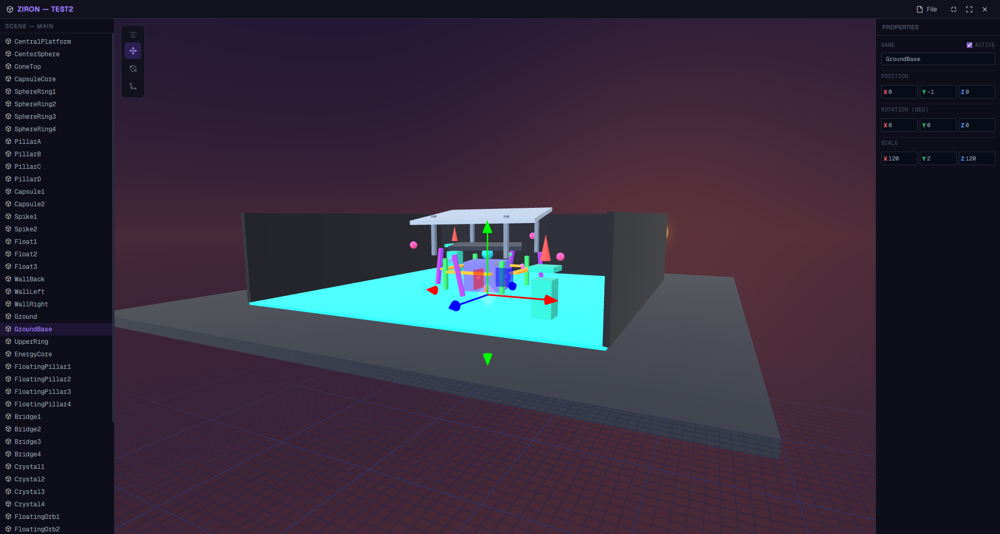
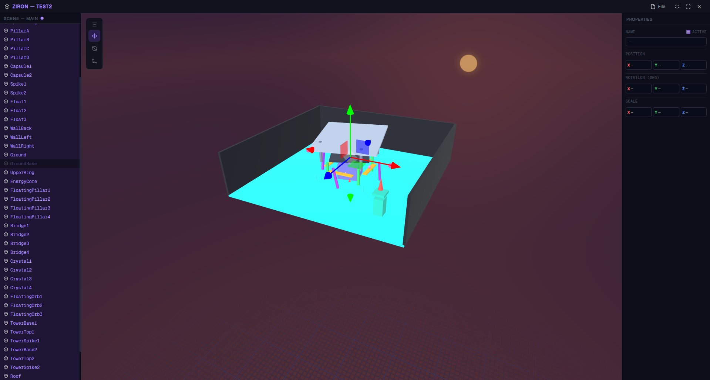
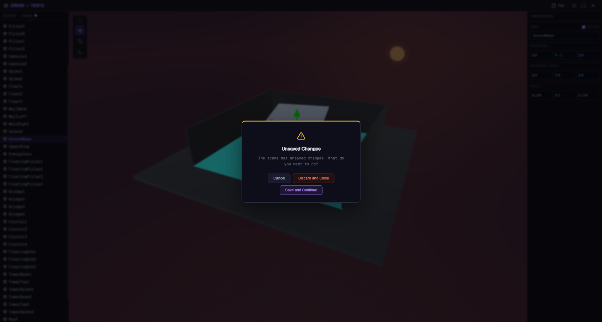

# ZIRON Engine

> A lightweight 3D scene editor built with Tauri, Three.js and Vite.

## Screenshots

|                        |                        |
| :--------------------: | :--------------------: |
|  |  |
|  |  |

<p align="center">
  
</p>

---

## What is ZIRON?

ZIRON Engine is a desktop 3D editor aimed at eventually becoming a full game engine. Right now it sits at the foundation layer — a native desktop window running a real-time Three.js viewport, with editor-grade controls and tools, packaged as a native app via Tauri.

No Electron. No browser tab. Just a lean, native binary with a WebGL renderer inside.

---

## Stack

| Layer            | Technology                           |
| ---------------- | ------------------------------------ |
| Desktop shell    | [Tauri v2](https://tauri.app) (Rust) |
| 3D renderer      | [Three.js](https://threejs.org)      |
| Frontend tooling | [Vite](https://vitejs.dev)           |
| UI icons         | [Lucide](https://lucide.dev)         |

---

## Current features

### Viewport & Scene

- **3D viewport** — real-time WebGL scene with a skybox and infinite grid
- **Fly camera** — navigate the scene with `W A S D` + right-click drag
- **Sun entity** — directional light whose X rotation dynamically shifts the skybox sky/horizon colors
- **Infinite grid** — world-space grid that follows the camera

### Selection

- **Single selection** — click any mesh to select it and attach the transform gizmo
- **Multi-selection** — drag a marquee box or use `Shift`/`Ctrl` click to select multiple entities
- **Shift+click range** and **Ctrl+click toggle** in the hierarchy panel

### Transform

- **Transform gizmo** — translate, rotate and scale selected objects in world space
- **Multi-transform** — move, rotate and scale multiple entities simultaneously via a shared pivot

### Properties panel

- **Single & multi-selection editing** — name, active state, position, rotation and scale
- **Mixed value display** — when a field differs across a multi-selection, it shows `—`
- **Bulk rename with template** — renaming a multi-selection to `Cube {id}` assigns `Cube 1`, `Cube 2`… top to bottom
- **Active toggle** — checkbox with indeterminate state when the selection is mixed

### Scene hierarchy

- **Hierarchy panel** — lists all scene entities, reflects renames and active state in real time
- **Inline rename** — `F2` or double-click to rename directly in the panel

### History

- **Undo/redo** — full history for transforms, renames, active toggles, creation and deletion (`Ctrl+Z` / `Ctrl+Y`)
- **Dirty indicator** — the hierarchy header shows an unsaved-changes dot whenever there are pending edits

### Project system

- **Project file** — `.ziron.project` with metadata (name, version, timestamps)
- **Scene persistence** — scenes saved as `.ziron.scene` JSON files
- **Recent projects** — list of the last 10 opened projects with last-opened timestamps
- **Version mismatch detection** — warns when opening a project created with a different engine version
- **Unsaved changes guard** — blocks window close and shows a confirmation popup if there are unsaved changes

### Editor shell

- **Context menu** — right-click the viewport or hierarchy to add, delete, duplicate, rename or copy/paste objects
- **i18n** — full English and Spanish localization
- **Custom logger** — structured log system with categories and visual formatting
- **Tooltip system** — hover tooltips throughout the UI
- **Toast notifications** — non-blocking feedback for save, load and error events
- **Popup system** — modal dialogs for confirmations and warnings
- **Keybind system** — configurable keybindings with browser-default overrides

---

## What it is NOT (yet)

ZIRON currently has no runtime or game logic layer. There is no scripting, no physics, no asset pipeline and no play mode. The goal is to build those systems on top of the editor foundation that exists today.

---

## Getting started

### Prerequisites

- [Node.js](https://nodejs.org) 18+
- [Rust](https://rustup.rs) (for Tauri)
- Tauri CLI — `cargo install tauri-cli`

### Install

```bash
git clone https://github.com/superstrellaa/ziron
cd ziron
npm install
```

### Run in development

```bash
npm run tauri dev
```

### Build

```bash
npm run tauri build
```

---

## Controls

| Input                     | Action               |
| ------------------------- | -------------------- |
| `W A S D`                 | Move camera          |
| Right-click drag          | Look around          |
| Left-click                | Select object        |
| Shift / Ctrl + left-click | Add to selection     |
| Left-click drag           | Marquee multi-select |
| Right-click (viewport)    | Open context menu    |
| `W`                       | Translate mode       |
| `E`                       | Rotate mode          |
| `R`                       | Scale mode           |
| `F2`                      | Rename selected      |
| `Ctrl + D`                | Duplicate selected   |
| `Ctrl + C / V`            | Copy / Paste         |
| `Delete`                  | Delete selected      |
| `Ctrl + Z`                | Undo                 |
| `Ctrl + Y`                | Redo                 |
| `Ctrl + S`                | Save scene           |

---

## Notes

- Renaming a multi-selection using `{id}` as a template replaces it with an incrementing index top-to-bottom — e.g. `Cube {id}` becomes `Cube 1`, `Cube 2`, etc.
- The sun entity dynamically shifts the skybox colors based on its X rotation, simulating a day/night cycle.
- The engine detects version mismatches when opening older projects and shows a compatibility warning.
- The editor blocks window close when there are unsaved changes, prompting save or discard.

---

## License

[MIT](LICENSE)
