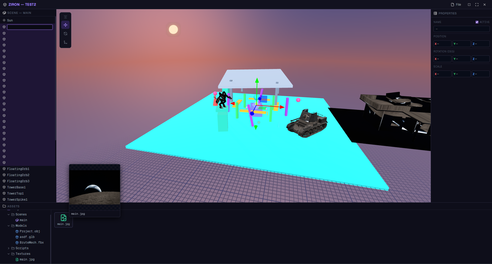
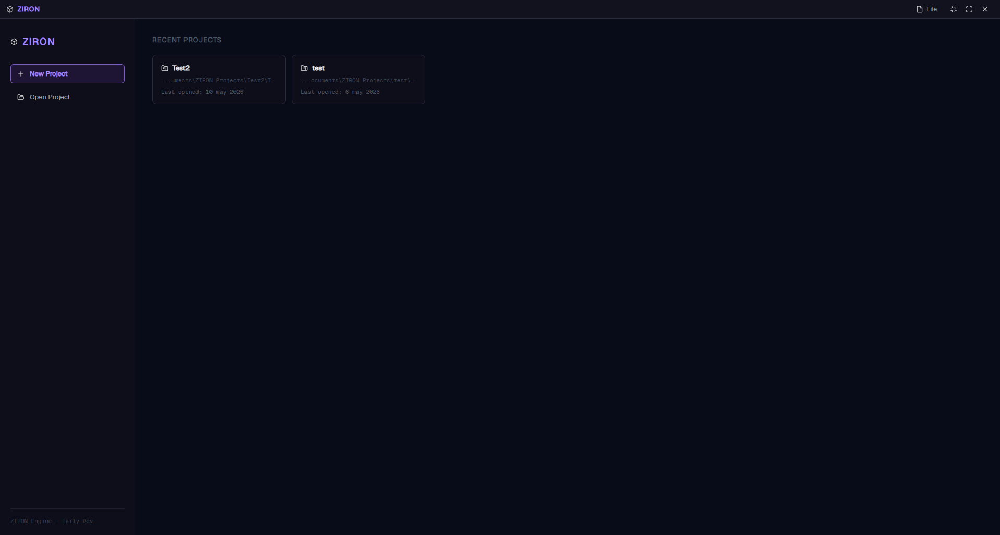
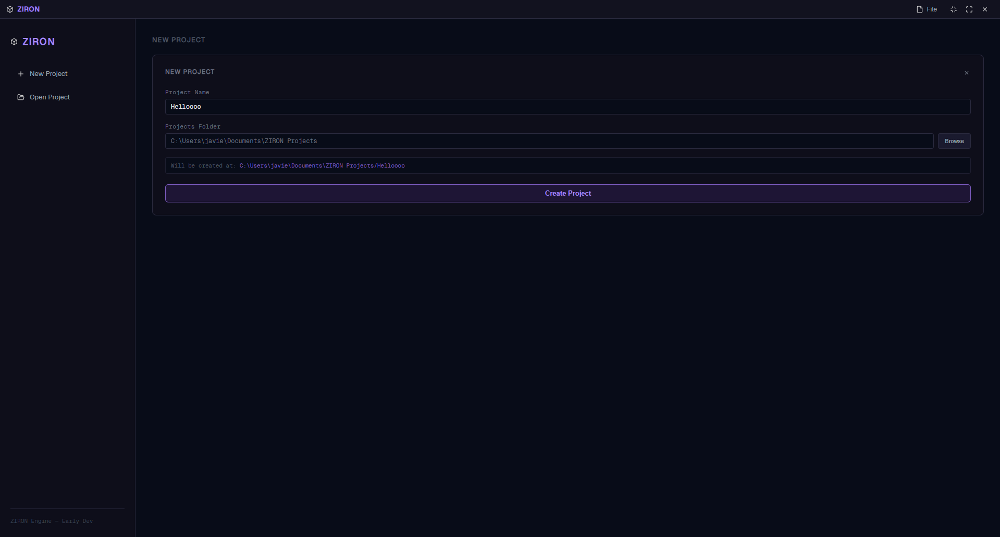
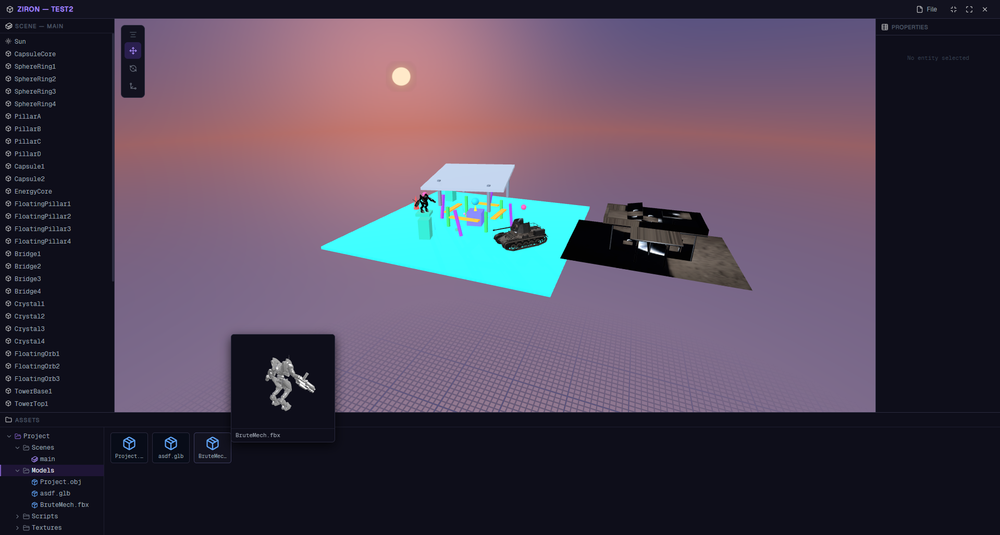
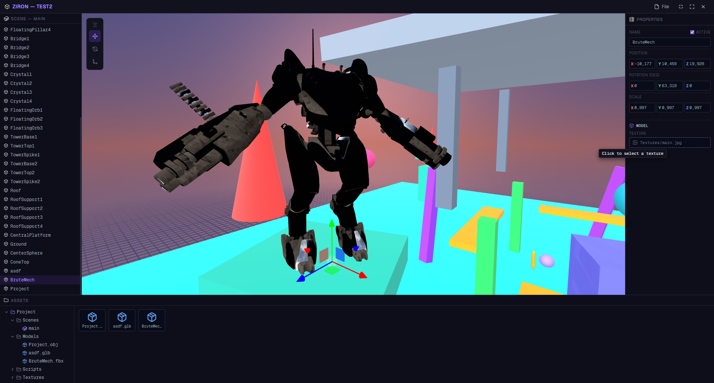

<p align="center">
  
</p>

<h1 align="center">ZIRON Studio</h1>

<p align="center">
  <strong>Lightweight 3D scene prototyping tool.</strong><br>
  Built with Tauri, Three.js and Vite.
</p>

<p align="center">
  <a href="https://github.com/superstrellaa/ziron/releases">
    
  </a>
  <a href="https://github.com/superstrellaa/ziron/blob/main/LICENSE">
    
  </a>
  <a href="https://github.com/superstrellaa/ziron">
    
  </a>
</p>

<p align="center">
  
</p>

---

## Screenshots

<p align="center">
  
  
</p>

<p align="center">
  
  
</p>

---

## What is ZIRON Studio?

ZIRON Studio is a lightweight desktop tool focused on fast 3D scene creation and visual prototyping.

Instead of being a full game engine, ZIRON aims to provide a clean and modern workflow for building stylized scenes, experimenting with compositions, testing lighting setups and quickly iterating on visual ideas.

Built with Tauri and Three.js, it combines native desktop performance with a fast WebGL-based renderer and an editor-first workflow.

**No Electron. No browser tabs. Just a lean native editor focused on creativity and iteration.**

---

## Vision

ZIRON Studio is designed around one core idea:

> **Create visually interesting 3D scenes as fast as possible.**

The project focuses on:

- Scene composition
- Visual prototyping
- Stylized rendering
- Creative workflows
- Lightweight tooling
- Fast iteration

Rather than competing with large-scale engines, ZIRON aims to be a focused and enjoyable creative tool.

---

## Stack

| Layer            | Technology                            |
| ---------------- | ------------------------------------- |
| Desktop shell    | [Tauri v2](https://tauri.app/) (Rust) |
| 3D renderer      | [Three.js](https://threejs.org/)      |
| Frontend tooling | [Vite](https://vitejs.dev/)           |
| UI icons         | [Lucide](https://lucide.dev/)         |

---

## Current Features

### Viewport & Scene

- Real-time 3D viewport
- Infinite world-space grid
- Dynamic skybox
- Directional sunlight system
- Fly camera controls
- Multi-object scene editing

### Selection & Transform

- Single and multi-selection
- Marquee selection
- Translate, rotate and scale gizmos
- Shared pivot multi-transform
- Inline hierarchy renaming

### Scene Editing

- Scene hierarchy panel
- Properties inspector
- Multi-edit support
- Active state toggles
- Bulk rename templates
- Undo / redo history system

### Project System

- `.ziron.project` project files
- `.ziron.scene` scene serialization
- Recent project management
- Unsaved changes protection
- Version compatibility checks
- Command-line project loading

### Editor Experience

- Context menus
- Toast notifications
- Popup/dialog system
- Configurable keybinds
- English / Spanish localization
- Structured logging system
- Tooltip system

---

## Getting Started

### Prerequisites

- [Node.js](https://nodejs.org/) 18+
- [Rust](https://rustup.rs/)
- Tauri CLI

Install the Tauri CLI with:

```bash
cargo install tauri-cli
```

### Install

```bash
git clone https://github.com/superstrellaa/ziron.git

cd ziron

npm install
```

### Development

Run ZIRON Studio in development mode:

```bash
npm run tauri dev
```

### Build

Create a production build:

```bash
npm run tauri build
```

---

## Controls

| Input                     | Action               |
| ------------------------- | -------------------- |
| `W A S D`                 | Move camera          |
| Right-click drag          | Look around          |
| Left-click                | Select object        |
| Shift / Ctrl + left-click | Add to selection     |
| Left-click drag           | Marquee multi-select |
| Right-click               | Open context menu    |
| `W`                       | Translate mode       |
| `E`                       | Rotate mode          |
| `R`                       | Scale mode           |
| `F2`                      | Rename selected      |
| `Ctrl + D`                | Duplicate selected   |
| `Ctrl + C / V`            | Copy / Paste         |
| `Delete`                  | Delete selected      |
| `Ctrl + Z`                | Undo                 |
| `Ctrl + Y`                | Redo                 |
| `Ctrl + S`                | Save scene           |

---

## Philosophy

ZIRON Studio is intentionally lightweight.

The goal is not to become an all-in-one AAA engine, but to create a fast, enjoyable and modern tool for visual experimentation and scene prototyping.

---

## License

ZIRON Studio is licensed under the [MIT License](LICENSE).
